# Logo-Classification
- Convolutional Neural Network to tell whether an image contains Apple logo or not.
- Click here for [demo](https://logo-classification-ravi.herokuapp.com/classify_logos/upload)

### Convolutional Neural Network
- Convolutional neural networks consist of several layers of small neuron collections that each look at small portions of an image.
- The results from all the collections in a layer are made to overlap to create a representation of the entire image.
- The layer below then repeats this process on the new image representation, allowing the system to learn about the makeup of the image.
- Deep convolutional neural networks were invented in the early 1980s. But it is only in the last couple of years that computers have begun to have the horsepower necessary for high-quality image recognition.

### Building CNN

#### Step 1: Importing the packages

We need five packages for building of convolution neural networks:
- Sequential
- Convolution2D
- MaxPooling2D
- Flatten
- Dense

Sequential:
  - This package is used to initialize the neural network. There are two ways of initializing a neural network:
	- Sequence of layers
	- Graph
  - Since convolution neural network is a sequence of layers, we initialize it using this package.

Convolution2D:
  - This is used to build the convolution layers. Images are generally represented in the 2D form and hence convolution 2D is used to build convolution layers.

MaxPooling2D:
  - This is used to add pooling layers.

Flatten:
  - It is used to convert all pooled feature maps created using convolution and max pooling into large feature vector which is the given as input to connected networks.

Dense:
  - This is used to add fully connected layers and artificial neural networks.

#### Step 2: Initializing Convolution Neural Network

To initialize CNN we have to create an object of the Sequential class:

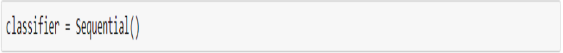

#### Step 3: Convolution

- We have an input image, we convert the image into table of pixel values.Several features are applied to the input image in the form of feature detectors.
- Then we move through the image to match these features with the image, whenever a match is found we get an feature map with higher values.
- For each feature detector we apply we get feature map of different values where higher values represent a  unique feature found by the feature detector.
- In this step we choose the number of feature detectors to get feature maps.
- We do this by using the following step:

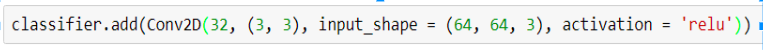

- The attributes of convolution2D function are:
  - nb_filter: Number of feature detectors.
  - nb_rows: Number of rows in the convolution layer (feature detector).
  - nb_cols: Number of columns in the convolution layer.
  - input_shape: Specifies the shape of input image.
    - The first argument specifies the number of layers in the input image, 3 if the image is colored each representing one of RGB.
    - The next arguments represents the number of pixels.
  - activation_funtion: Inorder to make sure that there is non-linearity in the feature maps, we apply rectifier function.

#### Step 4: Pooling

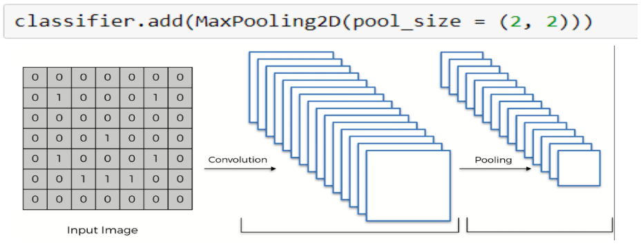

- We does this for reducing the size of feature maps.
- We slide over the feature map a pooling matrix to reduce the size of the feature map by half of its size+1 it it is initially an odd ordered matrix and half of the size if it is initially an even ordered matrix.
- For ex: if the initial size is 5 by 5 and we slide a 2 by 2 matrix with a stride two then we get a pooled matrix of size 3 by 3.
- We do this so that we reduce the number of nodes when we perform flattening. Since we build a one dimensional matrix corresponding to each feature map, hence reducing the number of nodes in fully connected layer and thus reducing time and space complexity.

#### Step 5: Flattening

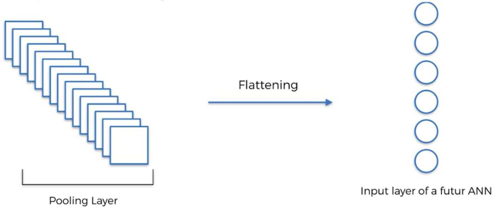

- In this we consider feature maps of all the different features and we build a single dimensional vector which is huge and is going to be served as input layer for neural network.
- We can directly perform flattening over the image but this leads to representation of a single dimension vector where each value represents a single node without relation with other nodes.

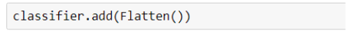

#### Steps completed till now

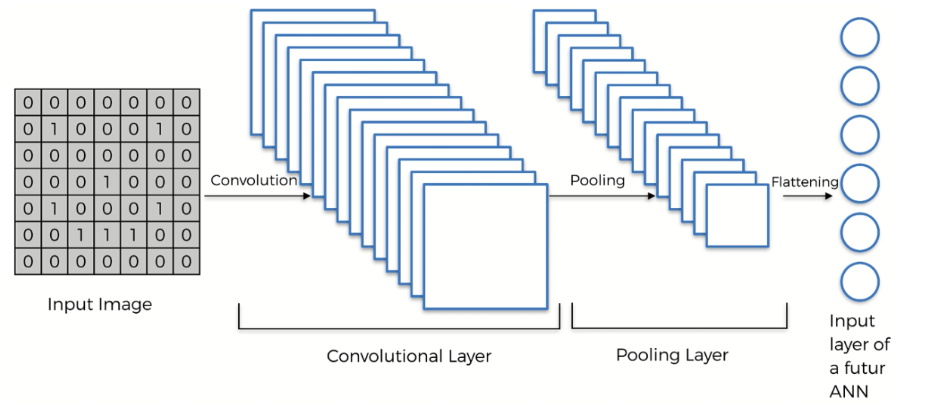

#### Step 6: Full Connection

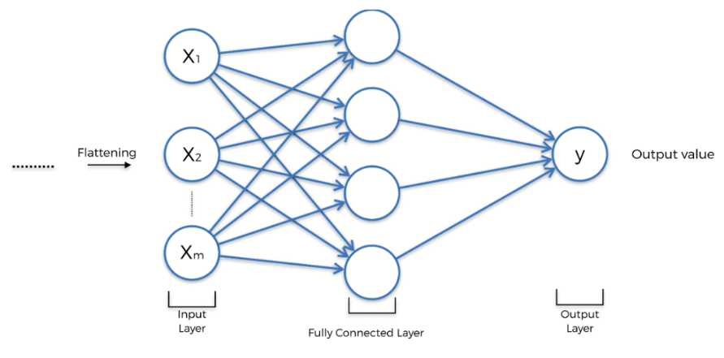

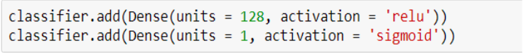

- First Dense Function (Hidden layer):
  - The units represents the number of nodes in the hidden layer.
  - We have to activate the nodes in the hidden layer so that they can vote towards a signal passing through them. For this we use rectifier activation function called relu.
- Second Dense Function (Output Layer):
  - The units contain only 1 since the output layer contains only one node.
  - We use sigmoid function since we have to get binary output (Apple or Not Apple logo).

#### Whole Convolutional Neural Network

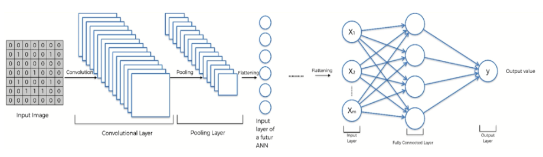

#### Step 7: Compiling

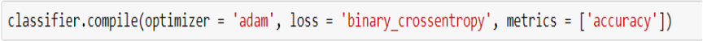

- We compile the CNN using stochastic gradient descent, loss function and performance metric.
 - Optimizer: used to choose stochastic gradient descent.
 - loss : used to define loss function, here we use binary_crossentropy.

#### Step 8: Image Processing

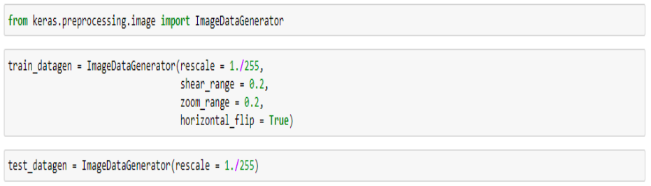

This step is used to generate image related data from our training set, test set and uses Keras image processing library.

#### Step 9: Fitting and Prediction

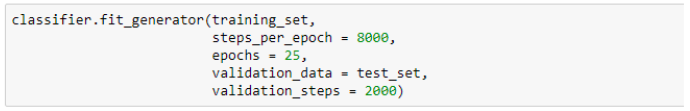

We fit the classifier on the training set and then we predict using test set.
